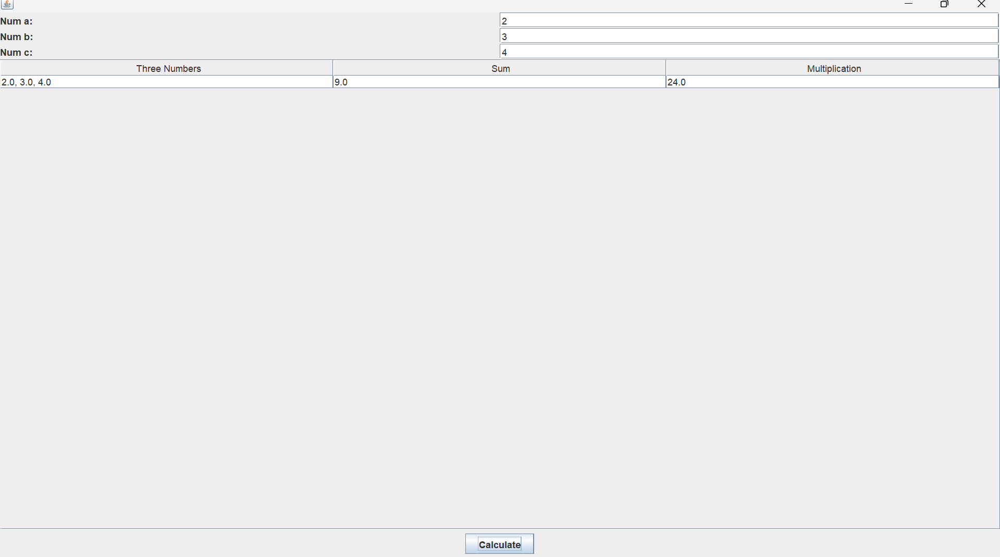

# Author
Daniel Nzambuli
665721

## Program Code

```java
import javax.swing.*;
import java.awt.*;
import javax.swing.table.DefaultTableModel;
import java.awt.event.ActionEvent;
import java.awt.event.ActionListener;

public class Calculator extends JFrame{

    // private Jframe frame;
    private JTextField num1, num2, num3;
    private JButton calculate;
    private JTable results;
    public Calculator(){
        // Create input fields
        JLabel num1Label = new JLabel("Num a:");
        JLabel num2Label = new JLabel("Num b:");
        JLabel num3Label = new JLabel("Num c:");
        num1 = new JTextField(10);
        num2 = new JTextField(10);
        num3 = new JTextField(10);

        // Create button
        calculate = new JButton("Calculate");
        calculate.addActionListener(new ActionListener() {
            @Override
            public void actionPerformed(ActionEvent e) {
                calculate();
            }
        });

        // Create table
        results = new JTable(new DefaultTableModel(
                new Object[]{"Three Numbers", "Sum", "Multiplication"}, 0));

        // Add components to the frame
        JPanel inputPanel = new JPanel(new GridLayout(3, 2));
        inputPanel.add(num1Label);
        inputPanel.add(num1);
        inputPanel.add(num2Label);
        inputPanel.add(num2);
        inputPanel.add(num3Label);
        inputPanel.add(num3);

        JPanel buttonPanel = new JPanel();
        buttonPanel.add(calculate);

        getContentPane().setLayout(new BorderLayout());
        getContentPane().add(inputPanel, BorderLayout.NORTH);
        getContentPane().add(new JScrollPane(results), BorderLayout.CENTER);
        getContentPane().add(buttonPanel, BorderLayout.SOUTH);
    }

    private void calculate() {
        try {
            // Get input values
            double a = Double.parseDouble(num1.getText());
            double b = Double.parseDouble(num2.getText());
            double c = Double.parseDouble(num3.getText());

            // Calculate sum and multiplication
            double sum = a + b + c;
            double multiplication = a * b * c;

            // Update table model
            String numbers = a + ", " + b + ", " + c;
            DefaultTableModel model = (DefaultTableModel) results.getModel();
            model.setRowCount(0);
            model.addRow(new Object[]{numbers , sum, multiplication});
        } catch (NumberFormatException e) {
            JOptionPane.showMessageDialog(this, "Please enter valid numbers.");
        }
    }

    public static void main(String[] args) {
        SwingUtilities.invokeLater(new Runnable() {
            @Override
            public void run() {
                new Calculator().setVisible(true);
            }
        });
    }
}
```

## Program Output Generated
